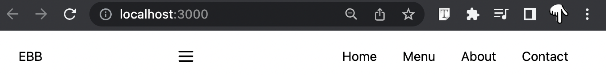

# Make a React Website with Tailwind CSS Tutorial

[Make a React Website with Tailwind CSS Tutorial](https://www.youtube.com/watch?v=gOQ31Kc8H5E)

## Klasik Responsive Mobil Header Yapısı

`Flex justify-between items-center relative yapısında`

- LOGO
- MobilBar SVG
- Menü Öğeleri



Hero için yapı

`h1.lg:text-9xl.md:text-7xl.sm:text-5xl.text-3xl.font-bold.mb-14`

```js script
<div className='flex flex-col items-center justify-center h-screen bg-white'>
  <h1 className='text-3xl font-bold lg:text-9xl md:text-7xl sm:text-5xl mb-14'>Hero</h1>
</div>
```

Animasyonlu Buton örneği
[svg cart simgesi linki](https://heroicons.com/)
svg cart simgesini `class='w-6 h-6 ml-4'` ile soldan 16px uzaklaştırıypruz.

```js script
<Link to='/' className='flex items-center px-10 py-6 text-3xl transition duration-300 ease-in-out bg-yellow-500 rounded-full hover:bg-yellow-300 animate-bounce'>
Order Now
<svg
    xmlns='http://www.w3.org/2000/svg'
    className='w-6 h-6 ml-4'
    fill='none'
    viewBox='0 0 24 24'
    stroke='currentColor'
    strokeWidth='2'>
    <path
    strokeLinecap='round'
    strokeLinejoin='round'
    d='M3 3h2l.4 2M7 13h10l4-8H5.4M7 13L5.4 5M7 13l-2.293 2.293c-.63.63-.184 1.707.707 1.707H17m0 0a2 2 0 100 4 2 2 0 000-4zm-8 2a2 2 0 11-4 0 2 2 0 014 0z'
    />
</Link>
```

### Github yayınlama aşamaları

- `yarn add gh-pages`
- **package.json** dosyası içinde
  - name altına "homepage": "https://gohugotr.github.io/website-tw-v2/",
  - scripts altına "deploy" : "git-pages -d build",
  - `yarn build`
  - `yarn deploy`